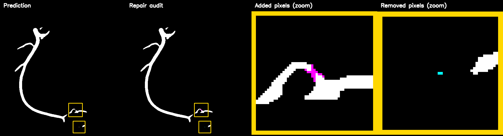
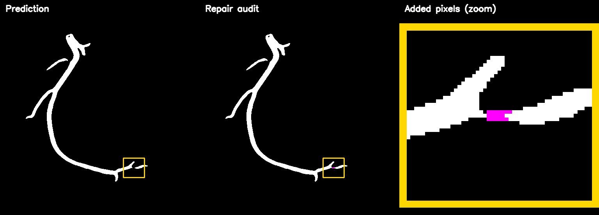
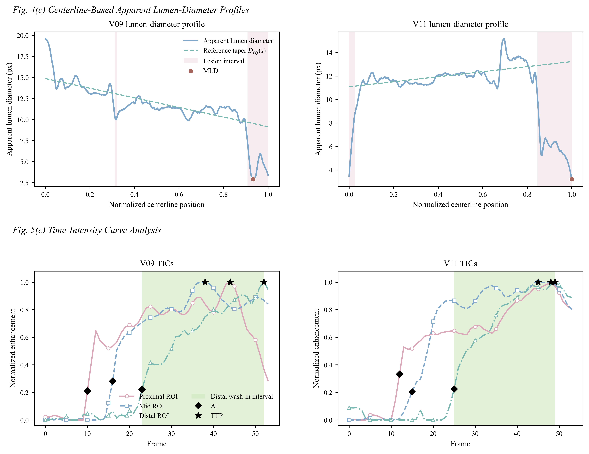

# BSC-Net: A Small-Branch-Sensitive Structural Continuity Network for Coronary Vessel Segmentation and Quantitative Angiographic Analysis

## Overview

Vessel segmentation in X-ray coronary angiography (XCA) is a fundamental step for quantitative coronary analysis and subsequent assessment of coronary artery disease. Accurate vessel segmentation remains challenging because of imaging noise, complex bifurcations, and the overlap of vessels and background structures, which can lead to disrupted vascular connectivity and missed small branches.

BSC-Net is a ResNet–U-Net-based framework tailored to improve small-vessel representation and repair vascular structural continuity. It enhances small-vessel representation through targeted sampling and improves vascular structural continuity by integrating long-range contextual modeling and Edge-Informed Loss (EIL).

BSC-Net achieves Dice/IoU scores of **77.80%/64.53%** on MOSXAV and **90.60%/83.00%** on ICA_NJ. The segmented vessels are further used for automated quantitative coronary analysis in two complementary categories: QCA-style anatomical morphometry and image-derived contrast-propagation assessment.

## Authors

Wanxian Li<sup>1,#</sup>, Jiaqian Qin<sup>1,#</sup>, Qingyi Xian<sup>1</sup>, Yazhi Li<sup>1</sup>, Song Chen<sup>2</sup>, Liman Li<sup>3</sup>, and Hao He<sup>1,*</sup>

<sup>1</sup> School of Biomedical Engineering, Sun Yat-sen University, Shenzhen 518107, China
<sup>2</sup> Department of Cardiovascular Surgery, Zhongnan Hospital of Wuhan University, Wuhan 430071, China
<sup>3</sup> Department of Laboratory Medicine, West China Hospital of Sichuan University, Chengdu 610041, China
<sup>#</sup> These authors contributed equally.
<sup>*</sup> Correspondence: Hao He (hehao23@mail.sysu.edu.cn)

## Method

BSC-Net uses a ResNet-34 U-Net as the backbone, incorporates small-vessel-aware sampling during training, introduces EIL at the loss level, and places a Swin Transformer only at the low-resolution bottleneck. These three components target increased exposure to thin and structurally vulnerable vessel regions, local structural consistency, and broader contextual modeling, respectively.

### Small-Vessel-Aware Sampling

Endpoints, bifurcation points, and thin-vessel regions are used as candidates for local cropping. Endpoints and bifurcations are identified from the 8-neighborhood degree of the skeleton, whereas thin-vessel points are determined from the lower-quantile region of the Euclidean distance transform on the skeleton.

A full image is selected with a probability of 0.40, whereas local cropping is selected with a probability of 0.60. The local crop scale is set to 30% of the original image extent and is resized to the unified 512×512 input size. Full images preserve learning of the overall vessel tree, while targeted local sampling improves the representation of small and weakly contrasted vessels during training.

### BSC-Net Architecture

BSC-Net employs an ImageNet-pretrained ResNet-34 encoder and a four-stage U-shaped decoder. The encoder extracts multiscale features, while the decoder progressively upsamples them and fuses the corresponding skip features. A segmentation head outputs the vessel probability map.

### Swin-Transformer

A Swin Transformer is incorporated into the low-resolution bottleneck to capture broader vascular context and model long-range vessel dependencies. By progressively enabling interactions within and across local windows, it propagates contextual information over larger spatial regions, complementing the predominantly local representations learned by the CNN. The resulting features are then fused with the original bottleneck features through a learnable residual connection.

### Edge-Informed Loss

EIL captures local vascular structural discrepancies by combining direction-aware gradient residuals with frequency-aware weighting within vessel neighborhoods. This formulation emphasizes structural errors such as boundary displacement, missing branches, and vessel discontinuities. Combined with MSE, Dice, and clDice, it complements pixel-, region-, and centerline-level supervision with local structural constraints.

The final training configuration is defined in [bscnet/presets.py](bscnet/presets.py).

### Post-Segmentation Quantitative Analysis

The segmentation probability maps and binary masks are refined by graph-guided vessel repair. The refined masks support downstream QCA-style anatomical morphometry and image-derived contrast-propagation assessment.

## Repository Structure

```text
BSC-Net/
├── bscnet/
│   ├── model.py                         # BSC-Net architecture
│   ├── data.py                          # Data loading and small-vessel-aware sampling
│   ├── engine.py                        # Training, losses, evaluation, and metrics
│   └── presets.py                       # Final experiment configuration
├── configs/
│   └── datasets.json                    # Dataset paths and splits
├── data/
│   ├── MOSXAV/                          # Processed static MOSXAV data
│   ├── MOSXAV_raw/                      # Original dynamic MOSXAV sequences
│   └── ICA_NJ/                          # ICA_NJ images and masks
├── checkpoints/
│   ├── bscnet_mosxav_best.pt
│   └── bscnet_ica_nj_best.pt
├── pretrained/
│   └── resnet34-b627a593.pth
├── postprocessing/
│   └── vessel_repair.py                 # Graph-guided vessel repair and visual audit
├── quantitative_analysis/
│   ├── generate_figures.py              # Plot saved QCA and hemodynamic results
│   ├── morphology/
│   │   └── structural_analysis.py       # QCA-style anatomical morphometrics
│   └── hemodynamics/
│       └── hemodynamic_analysis.py      # Contrast-propagation parameters and TICs
├── results/
│   ├── segmentation/                    # MOSXAV and ICA_NJ metric summaries
│   ├── predictions/                     # V09 and V11 predictions
│   ├── postprocessing/                  # V09 and V11 postprocessed masks
│   └── quantitative_analysis/           # Morphometry, contrast-propagation metrics, and figures
├── train.py
├── evaluate.py
├── infer.py
├── run_pipeline.py
├── requirements.txt
├── environment.yml
└── LICENSE
```

## Installation

The experiments reported in the paper used PyTorch 2.6.0 and a single NVIDIA RTX 3090. The packaged reproduction environment uses Python 3.10.20, PyTorch 2.7.1, and CUDA 12.8.

```bash
conda create -n bscnet python=3.10 -y
conda activate bscnet

pip install torch==2.7.1 --index-url https://download.pytorch.org/whl/cu128
pip install -r requirements.txt
```

The environment can also be created from `environment.yml`:

```bash
conda env create -f environment.yml
conda activate bscnet
```

## Datasets

The repository contains the processed static segmentation datasets and the original dynamic MOSXAV sequences.

| Dataset       | Contents                                                  |                 Samples |
| ------------- | --------------------------------------------------------- | ----------------------: |
| MOSXAV raw    | Original`trainval` and `test` dynamic sequences       |            1,905 frames |
| MOSXAV static | Peak-opacification-centered static image–mask pairs      |  146 training + 76 test |
| ICA_NJ        | Static image–mask pairs using the original 4:1 partition | 492 training + 124 test |

MOSXAV contains original frames, instance annotations, semantic annotations, and split files:

```text
data/MOSXAV_raw/
├── trainval/
│   ├── Annotations/
│   ├── Annotations_Semantic/
│   ├── JPEGImages/
│   └── ImageSets/
└── test/
    ├── Annotations/
    ├── Annotations_Semantic/
    ├── JPEGImages/
    └── ImageSets/
```

The static segmentation configuration is stored in [configs/datasets.json](configs/datasets.json).

Dataset sources:

- MOSXAV: [https://xilin-x.github.io/MOSXAV/](https://xilin-x.github.io/MOSXAV/)
- ICA_NJ: [https://github.com/MIILab-MTU/ICA_NJ_BinarySeg](https://github.com/MIILab-MTU/ICA_NJ_BinarySeg)

Please follow the original dataset licenses, institutional requirements, and applicable privacy rules when using or redistributing the angiographic data.

## Model Weights

The final single-model checkpoints are stored in `checkpoints/`. The checkpoint and ImageNet initialization files are configured for Git LFS in `.gitattributes`.

| Checkpoint                | Dataset | Seed | Global Dice | Threshold |
| ------------------------- | ------- | ---: | ----------: | --------: |
| `bscnet_mosxav_best.pt` | MOSXAV  | 2026 |    0.802805 |     0.699 |
| `bscnet_ica_nj_best.pt` | ICA_NJ  |    5 |    0.900717 |     0.296 |

`pretrained/resnet34-b627a593.pth` provides the ImageNet initialization for the ResNet-34 encoder.

## Training

The final experiments use 512×512 inputs, AdamW with an initial learning rate of 1e-4 and weight decay of 1e-4, cosine annealing to 1e-6, 50 epochs, a batch size of 2, and fivefold training-set repetition.

```bash
python train.py --dataset mosxav --device cuda:0 --batch-size 2 --num-workers 4
python train.py --dataset ica_nj --device cuda:0 --batch-size 2 --num-workers 4
```

The reported experiments did not use automatic mixed precision. `--amp` remains available as an optional memory-saving setting for reproduction. Training outputs are stored in `outputs/<dataset>/train/`; checkpoints are written to `outputs/<dataset>/train/checkpoints/{best,last}.pt`, alongside the metric files.

## Evaluation

```bash
python evaluate.py --dataset mosxav --device cuda:0
python evaluate.py --dataset ica_nj --device cuda:0
```

Evaluation outputs are stored in `outputs/<dataset>/evaluation/`:

```text
outputs/<dataset>/evaluation/
├── predictions/
├── probabilities_png/
├── probabilities_npy/
└── metrics/
    ├── summary_metrics.json
    ├── summary_metrics.csv
    └── per_frame_metrics.csv
```

## Inference

`infer.py` recursively processes XCA images and preserves the input directory hierarchy in its outputs.

```bash
python infer.py \
  --dataset mosxav \
  --input-dir data/MOSXAV_raw/test/JPEGImages \
  --output-dir outputs/mosxav_raw/inference \
  --device cuda:0
```

The output directory contains binary masks, 8-bit probability maps, and float32 NumPy probability maps:

```text
outputs/mosxav_raw/inference/
├── masks/
├── probabilities/
└── probabilities_npy/
```

## Postprocessing

Graph-guided vessel repair uses the binary predictions and float32 probability maps produced during inference. It first removes only tiny **disconnected** islands (default: <=32 pixels), which are not anatomically continuous with a coronary tree. It then accepts a bridge only when two endpoint tangents face each other and the least-cost path is consistently supported by the probability map. The accepted path is expanded to the local vessel caliber (up to 9 pixels) so that a repaired branch is continuous. One-ended extension is disabled by default because it cannot demonstrate closure of a discontinuity.

```bash
python postprocessing/vessel_repair.py \
  --base-mask-dir outputs/mosxav_raw/inference/masks \
  --probability-dir outputs/mosxav_raw/inference/probabilities_npy \
  --output-dir outputs/mosxav_raw/postprocessed
```

The output includes refined PNG masks, `repair_overlays/`, readable `repair_audits/` with change-region magnification, `parameters.json`, and `processing_metrics.csv`. In each audit, unchanged prediction is white, accepted bridge pixels are **magenta**, and removed disconnected islands are **cyan**. The CSV separately reports `added_area`, `removed_area`, and connected-component counts, so an apparent improvement cannot be confused with an unreported enlargement of the mask.

## Quantitative Analysis

### QCA-Style Anatomical Morphometrics

The largest connected vessel component is retained from each postprocessed mask and skeletonized to extract a continuous main-trunk centerline. The apparent lumen diameter is twice the distance-transform radius along the centerline. A tapering reference vessel diameter (RVD) is fitted after iterative exclusion of candidate stenotic points, and diameter stenosis (DS) is calculated from the apparent and reference diameter profiles. The calculation and all numericexports are implemented by `quantitative_analysis/morphology/structural_analysis.py`:

```bash
python quantitative_analysis/morphology/structural_analysis.py \
  --videos v09 v11 \
  --mask-root outputs/mosxav_raw/postprocessed \
  --peak-frames v09=46 v11=52 \
  --output-dir outputs/quantitative_analysis/morphology
```

For every case, the command prints the diameter range, minimum lumen diameter (MLD), RVD, and maximum DS. It also saves the full diameter/stenosis profile as CSV and summary metrics as JSON.

### Image-Derived Contrast-Propagation Parameters

Proximal, middle, and distal ROIs are placed at normalized positions along the main trunk and tracked frame by frame. Time–intensity curves are extracted after background correction, grayscale-polarity alignment, smoothing, and baseline correction. The same script calculates AT, TTP, maximum wash-in slope, proximal-to-distal CTFC-like delay, and relative contrast-propagation velocity. 

```bash
python quantitative_analysis/hemodynamics/hemodynamic_analysis.py \
  --videos v09 v11 \
  --mask-root outputs/mosxav_raw/postprocessed \
  --frame-root data/MOSXAV_raw/test/JPEGImages \
  --peak-frames v09=46 v11=52 \
  --output-dir outputs/quantitative_analysis/hemodynamics
```

The command prints every calculated value after processing and saves per-case JSON, a summary CSV, paper-style per-case TICs, and a combined TIC figure. For example:

```text
V09
ROI        AT    TTP    Max wash-in slope
proximal   10     44             0.041270
mid        16     38             0.034587
distal     23     52             0.011658
CTFC-like delay: 13 frames
Relative contrast-propagation velocity: 29.874037 pixel/frame
```

### Complete Pipeline

One command loads the packaged or user-selected checkpoint, evaluates the labeled test split, exports predictions and IoU/Dice/Sensitivity/Precision, segments the dynamic frames, performs postprocessing, and then prints and saves both QCA-style anatomical morphometrics and image-derived contrast-propagation results:

```bash
python run_pipeline.py \
  --input-dir data/MOSXAV_raw/test/JPEGImages \
  --frame-root data/MOSXAV_raw/test/JPEGImages \
  --output-dir outputs/mosxav_raw \
  --videos v09 v11 \
  --device cuda:0 \
  --peak-frames v09=46 v11=52
```

Add `--checkpoint path/to/model.pt` to select another trained model. Add `--train` to train the final preset first; the pipeline will automatically use `training/checkpoints/best.pt` for all subsequent stages. The output root is organized as `segmentation_evaluation/`, `inference/`, `postprocessed/`, and `quantitative_analysis/{morphology,hemodynamics,figures}/`.

Apparent lumen-diameter profiles and time–intensity curves (TICs) are generated directly from the numerical results:

```bash
python quantitative_analysis/generate_figures.py \
  --morphology-dir outputs/quantitative_analysis/morphology \
  --hemodynamics-dir outputs/quantitative_analysis/hemodynamics \
  --output-dir outputs/quantitative_analysis/figures
```

Running `python quantitative_analysis/generate_figures.py` without arguments regenerates the included figure from the packaged V09/V11 results.

## Results

### Packaged Checkpoint Verification

| Dataset | Test images | Global Dice | Global IoU | Sensitivity | Precision |
| ------- | ----------: | ----------: | ---------: | ----------: | --------: |
| MOSXAV  |          76 |      0.8028 |     0.6706 |      0.7990 |    0.8067 |
| ICA_NJ  |         124 |      0.9007 |     0.8194 |      0.8971 |    0.9043 |

The summaries are included in `results/segmentation/mosxav/` and `results/segmentation/ica_nj/`. These verification values are aggregated from pixel counts over each complete test set; the paper results below are reported as the mean ± standard deviation over test images.

### Prediction and Postprocessing Results

The V09 and V11 examples are stored under `results/predictions/` and `results/postprocessing/`. The audit overlays make each intervention visible: white = retained prediction, magenta = accepted repair pixels, cyan = removed isolated false-positive pixels.

| Case               |                                          Enlarged postprocessing audit                                          |
| ------------------ | :--------------------------------------------------------------------------------------------------------------: |
| V09 — frame 00043 |  |
| V11 — frame 00036 |  |

The displayed frames were selected after rerunning BSC-Net and the revised repair on all 54 frames of each sequence. Both contain a probability-supported **two-ended bridge** and fewer connected components. V09 frame 00043 adds 19 magenta repair pixels, removes two cyan isolated pixels, and reduces components from 6 to 4 (Dice: 0.7718 to 0.7728). V11 frame 00036 adds 18 magenta repair pixels and reduces components from 3 to 2 (Dice: 0.7862 to 0.7867). The enlarged panels show the closed gaps directly; these are not one-ended extensions.

### Quantitative-Analysis Figure



| Case | Proximal-to-distal AT delay (frames) | TTP delay (frames) | CTFC-like delay (frames) | Relative contrast-propagation velocity (pixel/frame) |
| ---- | -----------------------------------: | -----------------: | -----------------------: | ---------------------------------------------------: |
| V09  |                                   13 |                  8 |                       13 |                                                29.87 |
| V11  |                                   13 |                  1 |                       13 |                                                25.41 |

The corresponding PDF, editable SVG, plotting-source CSV files, QCA-style anatomical metrics, and image-derived contrast-propagation metrics are provided under `results/quantitative_analysis/`. The`morphology/` and `hemodynamics/` folders contain code-generated per-case results and summaries.

### Segmentation Performance

| Dataset | Method  |                      IoU |                     Dice |    Sensitivity |                Precision |
| ------- | ------- | -----------------------: | -----------------------: | -------------: | -----------------------: |
| MOSXAV  | BSC-Net | **0.645 ± 0.115** | **0.778 ± 0.092** | 0.815 ± 0.121 | **0.767 ± 0.135** |
| ICA_NJ  | BSC-Net | **0.830 ± 0.064** | **0.906 ± 0.043** | 0.905 ± 0.054 |           0.909 ± 0.057 |

### Progressive Ablation on MOSXAV

| Small-vessel sampling | EIL | Swin |                        IoU |                       Dice |                Sensitivity |                  Precision |
| :-------------------: | :-: | :--: | -------------------------: | -------------------------: | -------------------------: | -------------------------: |
|          –          | – |  –  |           0.6014 ± 0.1185 |           0.7439 ± 0.0980 |           0.7889 ± 0.1237 |           0.7219 ± 0.1333 |
|          ✓          | – |  –  |           0.6162 ± 0.1168 |           0.7558 ± 0.0935 | **0.8315 ± 0.1075** |           0.7072 ± 0.1223 |
|          ✓          | ✓ |  –  |           0.6307 ± 0.1209 |           0.7663 ± 0.0981 |           0.7843 ± 0.1173 |           0.7585 ± 0.1109 |
|          ✓          | ✓ |  ✓  | **0.6453 ± 0.1148** | **0.7780 ± 0.0922** |           0.8150 ± 0.1212 | **0.7672 ± 0.1353** |

## Citation

### BSC-Net

```bibtex
@article{li2026bscnet,
  title   = {BSC-Net: A Small-Branch-Sensitive Structural Continuity Network for Coronary Vessel Segmentation and Quantitative Angiographic Analysis},
  author  = {Li, Wanxian and Qin, Jiaqian and Xian, Qingyi and Li, Yazhi and Chen, Song and Li, Liman and He, Hao},
  note    = {Preprint manuscript},
  year    = {2026}
}
```

### Datasets

```bibtex
@article{xi2026mosxav,
  title   = {Few-shot video object segmentation in X-ray angiography using local matching and spatio-temporal consistency loss},
  author  = {Xi, Lin and Ma, Yingliang and Zhuang, Xiahai},
  journal = {Neural Networks},
  volume  = {200},
  pages   = {108808},
  year    = {2026},
  doi     = {10.1016/j.neunet.2026.108808}
}

@article{zhao2021ica,
  title   = {Automatic extraction and stenosis evaluation of coronary arteries in invasive coronary angiograms},
  author  = {Zhao, Chen and Vij, Aviral and Malhotra, Saurabh and Tang, Jinshan and Tang, Haipeng and Pienta, Drew and Xu, Zhihui and Zhou, Weihua},
  journal = {Computers in Biology and Medicine},
  volume  = {136},
  pages   = {104667},
  year    = {2021},
  doi     = {10.1016/j.compbiomed.2021.104667}
}
```

## License

This project is released under the [MIT License](LICENSE).
